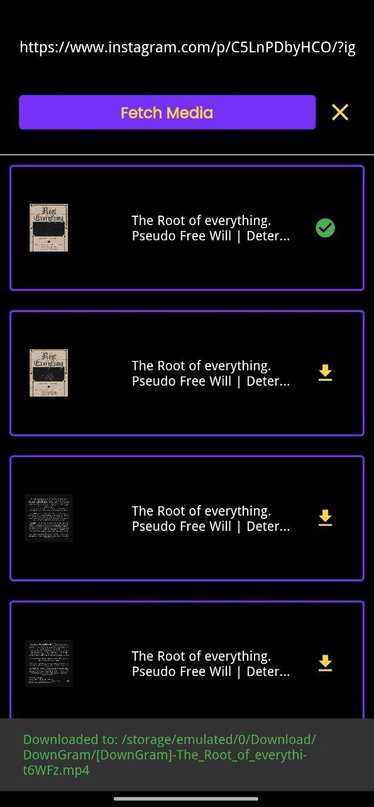

# DownGram - Instagram Downloader App

DownGram is a Flutter-based application designed to simplify the process of downloading content from Instagram. It provides users with the ability to download images, videos, and other media directly from Instagram, without the need for authentication. The backend is built using Node.js.

## Features

- **Download Instagram Content**: Users can download images, videos, and other media from Instagram directly through the app.
- **Seamless Sharing**: Users can share content from the Instagram app directly to DownGram for quick and easy downloading.
- **Node.js Backend**: The backend infrastructure is powered by Node.js, ensuring efficient handling of download requests.

## Getting Started

To get started with DownGram, follow the steps below:

1. **Clone the Repository**: 
    ```bash
    git clone https://github.com/AbhiCrackerOfficial/DownGram-App.git
    ```

2. **Navigate to the Project Directory**:
    ```bash
    cd DownGram-App
    ```

3. **Install Dependencies**: 
    ```bash
    flutter pub get
    ```

4. **Run the App**: 
    ```bash
    flutter run
    ```

## Usage

1. Open the Instagram app on your device.
2. Find the content you want to download.
3. Tap on the share button and select "Share to DownGram" from the options.
4. DownGram will be opened, and the content will be available for download.

## Screenshots


*Home Screen*


*Downloading Content*

## Contributing

Contributions to DownGram are welcome! If you have any suggestions for improvements or encounter any issues, feel free to open an issue or submit a pull request.

## License

This project is licensed under the [MIT License](LICENSE).

---
